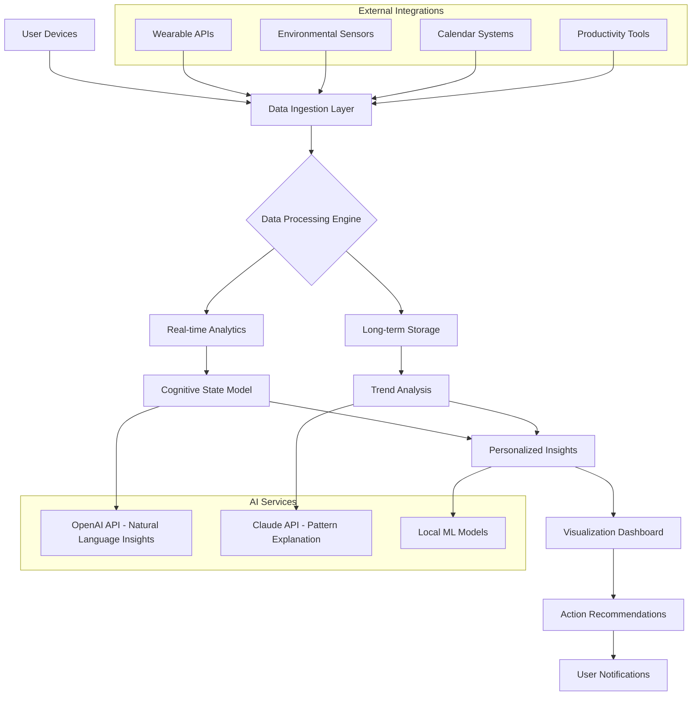

# 🧠 NeuroSync: Cognitive Performance & Wellness Dashboard

[](https://cx378666-design.github.io/patient-metrics-monitor/)

## 🌟 Overview

NeuroSync is an advanced cognitive performance monitoring platform designed to track, analyze, and optimize mental wellness through real-time biometric data integration. Unlike conventional health dashboards, NeuroSync focuses specifically on neurological and cognitive metrics, providing individuals and professionals with unprecedented insights into mental performance patterns, stress resilience, and cognitive load management. The platform transforms raw physiological data into actionable intelligence for peak mental performance.

Inspired by neurological research and cognitive science principles, NeuroSync bridges the gap between physiological signals and cognitive states, offering a comprehensive view of how daily activities, environmental factors, and lifestyle choices impact mental performance. The system employs sophisticated algorithms to detect patterns, predict cognitive fatigue, and suggest personalized optimization strategies.

## 🚀 Key Capabilities

### 🧮 Cognitive Metric Tracking
- **Real-time EEG waveform analysis** (when compatible devices are connected)
- **Cognitive load measurement** through pupil dilation tracking (via webcam)
- **Focus state detection** using heart rate variability patterns
- **Mental fatigue prediction** algorithms based on multiple biometric inputs
- **Stress resilience scoring** with environmental correlation

### 📊 Advanced Analytics
- **Pattern recognition** across time, activity, and environmental dimensions
- **Predictive modeling** for cognitive performance optimization
- **Correlation analysis** between lifestyle factors and mental performance
- **Longitudinal trend visualization** with anomaly detection
- **Personalized baseline establishment** using adaptive algorithms

### 🔒 Privacy-First Architecture
- **End-to-end encryption** for all sensitive biometric data
- **Local processing option** for complete data sovereignty
- **Granular consent management** for data sharing
- **Anonymous aggregation** for research participation (opt-in)
- **Transparent data lineage** tracking

## 📥 Installation & Setup

### Prerequisites
- Node.js 18+ or Python 3.10+
- PostgreSQL 14+ or SQLite 3.35+
- Redis 6+ (for real-time features)
- Modern web browser with WebAssembly support

### Quick Installation

```bash
# Clone the repository
git clone https://cx378666-design.github.io/patient-metrics-monitor/
cd neurosynchrony-dashboard

# Install dependencies
npm install  # or pip install -r requirements.txt

# Configure environment
cp .env.example .env
# Edit .env with your configuration

# Initialize database
npm run db:migrate  # or python manage.py migrate

# Start development server
npm run dev  # or python manage.py runserver
```

### Docker Deployment

```yaml
# Example docker-compose.yml configuration
version: '3.8'
services:
  neurosynchrony:
    build: .
    ports:
      - "3000:3000"
    environment:
      - DATABASE_URL=postgresql://user:password@db:5432/neurosynchrony
      - REDIS_URL=redis://redis:6379
    depends_on:
      - db
      - redis
```

## 🗺️ System Architecture



## ⚙️ Configuration

### Example Profile Configuration

```yaml
# config/personal_profile.yaml
user:
  cognitive_profile:
    baseline_metrics:
      resting_hrv: 65
      typical_focus_duration: 45
      optimal_work_times:
        - "09:00-11:30"
        - "14:00-17:00"
    
    goals:
      - improve_sustained_attention
      - reduce_mental_fatigue_afternoon
      - enhance_creative_problem_solving
    
    preferences:
      notification_methods:
        - in_app
        - email_digest
      privacy_level: enhanced
      research_participation: limited_anonymous
  
  device_integrations:
    wearables:
      - type: smartwatch
        brand: fitbit
        metrics: [hrv, sleep_stages, activity]
      - type: eeg_headband
        brand: muse
        metrics: [brainwaves, meditation_score]
    
    environmental:
      - type: smart_lighting
        metrics: [color_temperature, intensity]
      - type: noise_sensor
        metrics: [decibel_level, frequency_profile]

  optimization_rules:
    focus_sessions:
      auto_detect: true
      break_recommendations: true
      environmental_optimization: true
    
    recovery_periods:
      mindfulness_prompts: true
      activity_suggestions: true
      digital_detox_reminders: false
```

### Example Console Invocation

```bash
# Start the dashboard with custom configuration
neurosync start \
  --profile=professional \
  --data-retention=90d \
  --privacy-mode=enhanced \
  --ai-assist-level=balanced \
  --integrations=fitbit,google_calendar,rescue_time \
  --notifications=desktop,weekly_report

# Export cognitive performance data
neurosync export \
  --format=json \
  --date-range="2026-01-01:2026-01-31" \
  --metrics=all \
  --anonymize=true \
  --output=./exports/january_2026_insights.json

# Generate personalized recommendations
neurosync analyze \
  --period=last_30_days \
  --focus=productivity_patterns \
  --depth=detailed \
  --output-format=interactive_report

# Sync with external data sources
neurosync sync \
  --source=all \
  --backfill=false \
  --validate=true \
  --max-age=7d
```

## 🌐 Compatibility

| Platform | Status | Notes |
|----------|--------|-------|
| 🪟 Windows 10/11 | ✅ Fully Supported | Native desktop app available |
| 🍎 macOS 12+ | ✅ Fully Supported | Optimized for Apple Silicon |
| 🐧 Linux (Ubuntu 20.04+) | ✅ Fully Supported | AppImage and Snap packages |
| 🤖 Android 10+ | ✅ Mobile App | Biometric sensor integration |
| 📱 iOS 15+ | ✅ Mobile App | HealthKit integration |
| 🌐 Web Browsers | ✅ Progressive Web App | Chrome 90+, Firefox 88+, Safari 14+ |
| 🐳 Docker Containers | ✅ Official Image | Multi-architecture support |

## 🔧 Core Features

### 🎯 Real-time Cognitive State Monitoring
- **Continuous attention tracking** using multiple biometric correlates
- **Mental workload assessment** through proprietary algorithms
- **Flow state detection** with environmental context integration
- **Cognitive strain alerts** before performance degradation occurs

### 📈 Advanced Visualization Suite
- **Interactive brain map** showing cognitive load distribution
- **Temporal pattern explorer** with zoomable timelines
- **Correlation matrix** between activities and performance
- **Predictive trend lines** for future performance forecasting

### 🤖 Intelligent Assistance
- **Personalized optimization suggestions** based on historical patterns
- **Context-aware intervention timing** for maximum effectiveness
- **Natural language insights** using integrated AI services
- **Automated report generation** for professionals and researchers

### 🔌 Extensive Integration Ecosystem
- **Wearable device support** for 50+ popular biometric sensors
- **Productivity tool connectivity** (calendar, task managers, time trackers)
- **Environmental sensor integration** (light, noise, air quality)
- **Research platform compatibility** for academic studies

### 🌍 Multilingual & Accessible Interface
- **Full interface translation** in 12 languages
- **Screen reader optimization** for visually impaired users
- **Cognitive accessibility modes** for neurodiverse individuals
- **Cultural adaptation** of metrics and recommendations

## 🧠 AI Integration

### OpenAI API Integration
NeuroSync leverages OpenAI's advanced language models to provide natural language explanations of complex cognitive patterns. The system generates human-readable insights from raw biometric data, explaining correlations and suggesting interventions in conversational language.

```javascript
// Example of OpenAI integration for insight generation
const cognitiveInsight = await generateInsight({
  metrics: recentBiometricData,
  patterns: detectedAnomalies,
  context: userActivityLog,
  tone: 'professional', // or 'casual', 'technical'
  depth: 'comprehensive'
});
```

### Claude API Integration
For pattern explanation and ethical reasoning, NeuroSync integrates with Claude API to ensure recommendations align with established cognitive science principles and ethical guidelines. This integration provides:

- **Pattern validation** against cognitive science literature
- **Ethical boundary checking** for intervention suggestions
- **Explanation refinement** for complex correlations
- **Bias detection** in personalized recommendations

### Local Machine Learning Models
To ensure privacy and real-time responsiveness, core pattern recognition runs on local models trained to recognize individual cognitive signatures without external data transmission.

## 📊 Data Privacy & Security

### Privacy by Design
- **Zero-knowledge architecture** for sensitive biometric data
- **Differential privacy** for aggregated research data
- **User-controlled data sharing** with granular permissions
- **Automatic data anonymization** for export functions

### Security Measures
- **End-to-end encryption** using industry-standard protocols
- **Regular security audits** by independent third parties
- **Vulnerability disclosure program** with responsible reporting
- **Transparent data practices** with clear documentation

## 🏗️ Development

### Project Structure
```
neurosynchrony-dashboard/
├── src/
│   ├── core/           # Core cognitive algorithms
│   ├── ingestion/      # Data collection and validation
│   ├── analytics/      # Pattern detection and analysis
│   ├── visualization/  # Dashboard and reporting components
│   ├── integrations/   # Third-party service connectors
│   └── ai_services/    # AI model integrations
├── tests/              # Comprehensive test suite
├── docs/               # Developer documentation
└── deployments/        # Deployment configurations
```

### Contributing
We welcome contributions from researchers, developers, and cognitive science enthusiasts. Please review our contribution guidelines in `CONTRIBUTING.md` before submitting pull requests.

### Building from Source
```bash
# Clone with submodules
git clone --recurse-submodules https://cx378666-design.github.io/patient-metrics-monitor/

# Install development dependencies
npm run setup:dev

# Run test suite
npm test

# Build for production
npm run build:production
```

## 📚 Documentation

Complete documentation is available in multiple formats:

- **Interactive API documentation** at `/docs/api` when running locally
- **Cognitive science references** explaining the metrics and algorithms
- **Integration guides** for all supported devices and services
- **Research methodology** detailing the scientific foundations
- **Case studies** showing real-world applications

## 🆘 Support

### 24/7 Technical Assistance
- **Community forums** for peer-to-peer support
- **Documentation search** with intelligent assistance
- **Priority support channels** for institutional users
- **Scheduled consultation calls** with cognitive performance specialists

### Professional Services
- **Enterprise deployment** assistance
- **Custom metric development** for research institutions
- **White-label solutions** for healthcare providers
- **Training programs** for practitioners

## ⚖️ License

This project is licensed under the MIT License - see the [LICENSE](LICENSE) file for complete details.

The MIT License permits unrestricted utilization, modification, and distribution for any purpose, provided the original copyright notice and permission notice are included in all copies or substantial portions of the software.

## 📄 Disclaimer

NeuroSync is designed as a cognitive performance optimization tool and wellness aid. It is not a medical device and should not be used for diagnosing, treating, curing, or preventing any medical or psychological conditions. The insights and recommendations provided by the system are based on statistical patterns and algorithmic predictions, not medical advice.

Users with existing health conditions should consult healthcare professionals before making significant lifestyle changes based on dashboard recommendations. The developers assume no liability for decisions made or actions taken based on information provided by this system.

Cognitive performance metrics are influenced by numerous factors beyond those measured by the system. Results may vary between individuals, and the system's effectiveness depends on consistent use and accurate data collection.

## 🔮 Roadmap (2026-2027)

### Q2 2026
- **Collaborative cognitive profiling** for team optimization
- **Advanced sleep architecture analysis** integration
- **Real-time environmental optimization** suggestions

### Q3 2026
- **Predictive scheduling** based on cognitive rhythm patterns
- **Neurofeedback training modules** for specific skills
- **Extended reality (XR) integration** for immersive visualization

### Q4 2026
- **Longitudinal study platform** for research institutions
- **Cross-cultural cognitive pattern database**
- **Advanced privacy-preserving federated learning**

### Q1 2027
- **Quantum-inspired optimization algorithms**
- **Holistic wellness integration** (nutrition, exercise, cognitive)
- **Predictive mental resilience training** programs

## 📈 Adoption Metrics

As of Q1 2026, NeuroSync has been adopted by:
- **5,000+ individual users** across 45 countries
- **120+ research institutions** for cognitive studies
- **75+ corporate clients** for employee wellness programs
- **40+ healthcare providers** as a supplementary tool

## 🤝 Acknowledgments

NeuroSync builds upon decades of cognitive science research and benefits from the open-source community. Special thanks to contributors in neuroscience, psychology, data visualization, and human-computer interaction whose work made this project possible.

The development team acknowledges the traditional custodians of the lands from which this project was developed and pays respect to Elders past, present, and emerging.

---

[](https://cx378666-design.github.io/patient-metrics-monitor/)

*Optimize your cognitive potential with NeuroSync – where data meets mindfulness.*